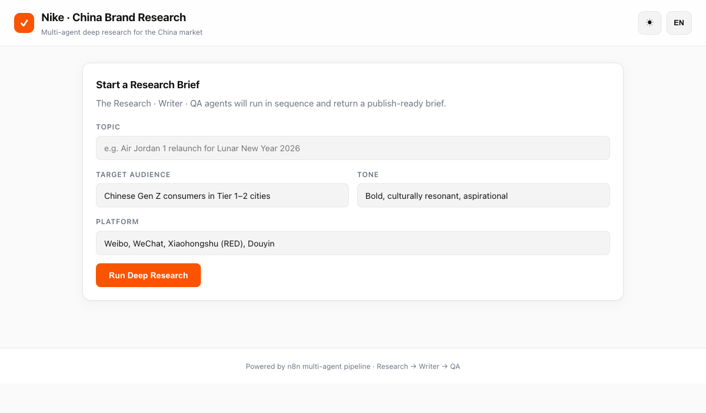
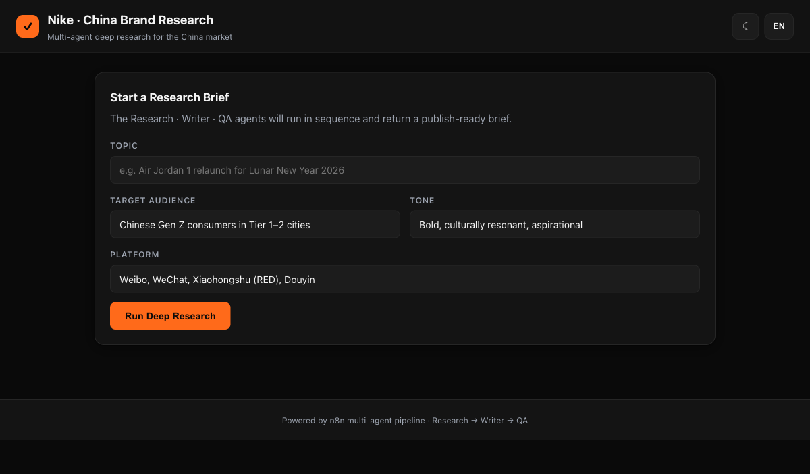

<div align="center">

# Nike · China Brand Deep Research

[](https://n8n.io)
[](https://openai.com)
[](https://tavily.com)
[](#)
[](#)
[](#)
[](#)
[](#license)

**A multi-agent AI research console for Nike's China brand team — submit a topic, get a publish-ready brief from Research → Writer → QA agents.**

[Live Demo](https://alfredang.github.io/n8nmultiagents/) · [Report Bug](https://github.com/alfredang/n8nmultiagents/issues) · [Discussions](https://github.com/alfredang/n8nmultiagents/discussions)

</div>

---

## Screenshot



<details>
<summary>Dark mode</summary>



</details>

---

## About

This project pairs a lightweight static frontend with an **n8n multi-agent workflow** so Nike's China marketing team can turn a single topic line into a fully-researched, QA-reviewed content brief tailored to platforms like Weibo, WeChat, Xiaohongshu (RED), and Douyin.

When the user submits a topic, a **Master Agent** orchestrates three specialist agents in sequence:

1. **Research Agent** — pulls verifiable facts via Tavily web search.
2. **Writer Agent** — drafts platform-ready content in the requested tone.
3. **QA / Critic Agent** — fact-checks, fixes, and scores the draft (0–100 confidence).

The frontend renders each stage as a scannable rich-text panel and lets you export the whole brief as markdown.

### Key Features

| | |
|---|---|
| 🧠 **3-agent pipeline** | Master orchestrator coordinates Research, Writer, and QA agents end-to-end. |
| 🔎 **Grounded research** | Tavily web search keeps the Research Agent from hallucinating. |
| ✅ **Self-correcting QA** | Critic agent fixes drift, softens unverified claims, and emits a confidence score. |
| 🇨🇳 **China-first defaults** | Audience, tone, and platform fields pre-filled for Tier 1–2 Gen Z on local platforms. |
| 🌗 **Dark / light theme** | Auto-detects system preference, persists the user's choice. |
| 🌐 **EN / 中文 toggle** | Every label, placeholder, and section heading translates in place. |
| 📄 **Markdown export** | One-click copy or `.md` download of the full Research / Draft / QA / Final brief. |
| ⚡ **Zero build step** | Pure HTML/CSS/JS — deploys as static files to GitHub Pages. |

---

## Tech Stack

| Layer | Technology |
|---|---|
| **Frontend** | HTML5, CSS3 (CSS custom-property theming), vanilla JavaScript (no framework, no build step) |
| **Rich text** | [`marked`](https://github.com/markedjs/marked) for markdown rendering · [`DOMPurify`](https://github.com/cure53/DOMPurify) for sanitization |
| **Agent runtime** | [n8n](https://n8n.io) self-hosted · LangChain agent nodes |
| **LLM** | OpenAI `gpt-4.1-mini` (all three agents) |
| **Web search** | [Tavily](https://tavily.com) as a tool bound to the Research Agent |
| **Transport** | HTTPS POST → n8n webhook → JSON response |
| **Hosting** | Static frontend on GitHub Pages · n8n on a private VPS |

---

## Architecture

```
 ┌─────────────────────────────────────────────────────────┐
 │                    Browser (GitHub Pages)               │
 │   index.html · styles.css · app.js · i18n.js            │
 │   [ topic + audience + tone + platform ]                │
 └───────────────────────────┬─────────────────────────────┘
                             │ HTTPS POST (JSON)
                             ▼
 ┌─────────────────────────────────────────────────────────┐
 │                     n8n Webhook                         │
 │   /webhook/8b934e29-d0d9-4621-ba27-0f42f947028d         │
 └───────────────────────────┬─────────────────────────────┘
                             ▼
 ┌─────────────────────────────────────────────────────────┐
 │                     Master Agent                        │
 │   gpt-4.1-mini · LangChain orchestrator                 │
 └─────┬─────────────────┬─────────────────┬───────────────┘
       ▼                 ▼                 ▼
 ┌───────────┐     ┌───────────┐     ┌─────────────┐
 │ Research  │     │  Writer   │     │   QA /      │
 │  Agent    │ ──▶ │  Agent    │ ──▶ │   Critic    │
 │           │     │           │     │   Agent     │
 │ + Tavily  │     │           │     │             │
 └───────────┘     └───────────┘     └──────┬──────┘
                                            ▼
 ┌─────────────────────────────────────────────────────────┐
 │             Normalizer (JS Code node)                   │
 │   → { research, draft, qa, final_content, score }       │
 └───────────────────────────┬─────────────────────────────┘
                             ▼
 ┌─────────────────────────────────────────────────────────┐
 │                  Respond to Webhook                     │
 │   Frontend renders sectioned report + markdown export   │
 └─────────────────────────────────────────────────────────┘
```

---

## Project Structure

```
n8nmultiagents/
├── README.md
├── screenshot.png                             # Light-mode hero
├── screenshot-dark.png                        # Dark-mode variant
├── Multi Agent Social media creator.json      # n8n workflow export
├── .github/
│   └── workflows/
│       └── deploy-pages.yml                   # GitHub Pages deploy action
└── web/
    ├── index.html                             # Single-page app
    ├── styles.css                             # Theming + layout
    ├── app.js                                 # Webhook + render logic
    └── i18n.js                                # EN / 中文 dictionary
```

---

## Getting Started

### Prerequisites

- An **n8n** instance (self-hosted or cloud) with the workflow from `Multi Agent Social media creator.json` imported and activated.
- An **OpenAI API key** (for the three agents).
- A **Tavily API key** (for web search).
- Any static web host or just `python3 -m http.server` for local development.

### 1. Import the n8n workflow

1. Open n8n → **Workflows → Import from file** → select `Multi Agent Social media creator.json`.
2. Attach your OpenAI credential to each `OpenAI Chat Model` node.
3. Attach your Tavily credential to the `Search in Tavily` node.
4. **Activate** the workflow and copy the production webhook URL.

### 2. Point the frontend at your webhook

In `web/app.js`, update the first line:

```js
const WEBHOOK_URL = "https://<your-n8n-host>/webhook/<your-webhook-id>";
```

### 3. Run locally

```bash
cd web
python3 -m http.server 8000
# open http://localhost:8000
```

Enter a topic (e.g. *"Air Jordan 1 relaunch for Lunar New Year 2026"*), click **Run Deep Research**, and wait ~30–90 seconds for the three agents to complete.

---

## Deployment

### GitHub Pages (automatic)

This repo ships with a GitHub Actions workflow at `.github/workflows/deploy-pages.yml` that deploys the `web/` folder to Pages on every push to `main`. To enable:

1. Push to `main`.
2. Repo **Settings → Pages → Source: GitHub Actions**.
3. Your site goes live at `https://<user>.github.io/<repo>/`.

### Any static host

The `web/` folder is fully self-contained — drop it into Netlify, Vercel, Cloudflare Pages, S3, or a plain nginx container. No build step is required.

---

## Request & Response Contract

**Request** (POST, `application/json`):

```json
{
  "timestamp": "2026-04-21T10:00:00.000Z",
  "user_id": "web-<uuid>",
  "topic": "Air Jordan 1 relaunch for Lunar New Year 2026",
  "target_audience": "Chinese Gen Z consumers in Tier 1–2 cities",
  "tone": "Bold, culturally resonant, aspirational",
  "platform": "Weibo, WeChat, Xiaohongshu (RED), Douyin"
}
```

**Response** (JSON):

```json
{
  "ok": true,
  "request": { "...": "..." },
  "research":   { "facts": [], "sources": [], "needs_verification": [], "research_summary": "..." },
  "draft":      { "content": "...", "character_count": 0 },
  "qa":         { "issues_found": [], "fact_check_flags": [], "improvements_made": [], "confidence_score": 92, "final": { "content": "...", "ready_to_publish": true } },
  "final_content": "...",
  "confidence_score": 92
}
```

---

## Contributing

1. Fork this repo.
2. Create a feature branch: `git checkout -b feat/my-feature`.
3. Commit your changes and open a pull request.
4. Discuss ideas or questions in [GitHub Discussions](https://github.com/alfredang/n8nmultiagents/discussions).

---

## License

Released under the **MIT License**.

---

## Acknowledgements

- [n8n](https://n8n.io) — the low-code automation platform that orchestrates the agent pipeline.
- [LangChain](https://www.langchain.com) — the agent abstractions exposed through n8n's `@n8n/n8n-nodes-langchain` nodes.
- [OpenAI](https://openai.com) — GPT-4.1-mini, the reasoning engine for all three agents.
- [Tavily](https://tavily.com) — grounded web search that keeps the Research Agent honest.
- [marked](https://github.com/markedjs/marked) & [DOMPurify](https://github.com/cure53/DOMPurify) — safe markdown rendering in the browser.

Built by **Alfred Ang** · Tertiary Infotech Academy.

If this project was useful, please ⭐ the repo — it helps more than you'd think.
